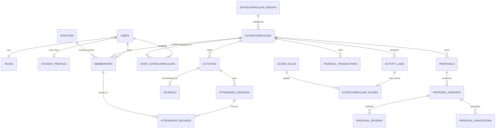

# EKSTRA — SMAN 1 Pacet

Sistem PHP/MySQL untuk publikasi dan pengelolaan ekstrakurikuler SMAN 1 Pacet. Situs publik menampilkan kegiatan dan berita; area internal menggunakan autentikasi, otorisasi berbasis peran **dan** lingkup ekstrakurikuler.

## Requirements and local installation

* PHP 8.2+ with `pdo_mysql`.
* MySQL 8.0+ or a compatible MariaDB release.
* Apache with `mod_rewrite`, or PHP’s built-in server for local development.

```bash
cp .env.example .env
# edit .env: set database credentials and a long random APP_KEY
mysql -u root -p -e 'CREATE DATABASE ekstra_pacet CHARACTER SET utf8mb4 COLLATE utf8mb4_unicode_ci'
mysql -u root -p ekstra_pacet < database/schema.sql
mysql -u root -p ekstra_pacet < database/seed.sql
php -S localhost:8000 -t public
```

Open `http://localhost:8000`. The seed intentionally does **not** create accounts or passwords. Create users through the future protected administrator workflow or a one-time deployment script using `password_hash()`; never add credentials to seed files.

## Structure

```text
app/
  Controllers/       HTTP endpoints
  Core/              routing, PDO bootstrapping, sessions, views
  Repositories/      parameterized data retrieval
  Services/          authentication and scoped authorization policy
  views/             public, authentication, and internal templates
database/            MySQL schema and the 27-extracurricular seed
public/              sole web root, front controller, CSS, JavaScript
storage/private/     non-public uploaded documents (not committed)
```

## Routing

| Area | Routes |
| --- | --- |
| Public | `/`, `/ekstrakurikuler`, `/ekstrakurikuler/{slug}`, `/berita`, `/berita/{slug}` |
| Authentication | `/login` (GET/POST), `/logout` (POST) |
| Internal | `/dashboard`, `/profil`; future scoped modules use `/ekstrakurikuler/{slug}/…` and `/admin/…` |

The front controller and `.htaccess` provide clean URLs. Public details are rendered through one slug-driven template, not individual pages for each activity.

## Data model and ERD



`memberships` has a unique `(user_id, extracurricular_id)` key and references `positions`; positions are therefore never global user attributes. `staff_extracurriculars` similarly scopes Pembina/Pelatih access. Foreign keys, unique keys, and purpose-specific indexes are declared in `database/schema.sql`; `JSON` fields hold configurable journal fields, activity extensions, annotations, and audit metadata without duplicating core relations.

## Roles and authorization

| Account role | System authority |
| --- | --- |
| Siswa | Own memberships and attendance check-in only. |
| Inti | Manages an extracurricular only when an active membership position grants management. |
| Pembina/Pelatih | Manages only explicitly assigned extracurriculars. |
| Wakasek | Monitoring and proposal review/forwarding. |
| Kepala Sekolah | Monitoring and final proposal approval/rejection. |
| Admin/Developer | Technical data administration and maintenance; **not** an official proposal approver. |

`ScopeAuthorizer` is the server-side policy seam for any write endpoint. Feature controllers must call it, rather than relying on hidden buttons. Proposal review records have a `reviewer_stage` which distinguishes Wakasek review from Kepala Sekolah’s final decision.

## Operational design

* **Attendance:** `attendance_sessions` stores a hashed temporary token, open/close window, and status. `attendance_records` has a unique session/membership key that prevents duplicate check-ins. Check-in endpoints must validate an active membership in the same extracurricular as the session activity.
* **Journals:** `journals.fields` is JSON so the school can configure the official journal format later.
* **Proposals:** every uploaded version is immutable in `proposal_versions`; reviews and visual annotation payloads attach to a specific version. For a production PDF review UI, use maintained **PDF.js** for rendering plus an annotation layer that persists normalized annotation JSON in `proposal_annotations`. No dependency is included until the review UI is implemented.
* **Finance:** transactions are strictly scoped to the extracurricular; only positions with `grants_finance` should write.
* **Activity Score:** only approved domain events should be added to `activity_logs`. Editable `score_rules` map those meaningful events to `extracurricular_scores`; login/page-view events must never be score sources.
* **Achievements:** there is no invented approval state. Add one only after the school confirms its workflow.

## Security and deployment

* Database access uses PDO with native prepared statements and exception mode.
* Passwords use PHP `password_hash()` / `password_verify()`; sessions use `HttpOnly`, `SameSite=Lax`, HTTPS-only cookies when HTTPS is active, and session-ID rotation on login.
* State-changing built-in forms require CSRF tokens. Escape template output with `View::e()`.
* Store `.env` and uploaded files outside version control. The application’s document metadata points to `storage/private`, which must remain outside the web root; serve protected documents through an authorized controller.
* Validate extension, MIME type (using `finfo`), size, and generated storage names before adding a future upload record. Do not trust client filenames or MIME headers.
* Write auditable events to `audit_logs` for authentication, membership/position changes, proposal decisions, finance changes, attendance corrections, and administration.
* In production, set `APP_ENV=production`, use HTTPS, restrict database privileges, use a non-debug error page/log handler, and configure web-server access only to `public/`.

## NEEDS CONFIRMATION

The official extracurricular regulation, the journal template, achievement approval rules, Activity Score event/rule values, proposal document retention, and exact PDF annotation/review policy have not been supplied. The schema deliberately keeps these areas configurable and does not encode invented school policy.
